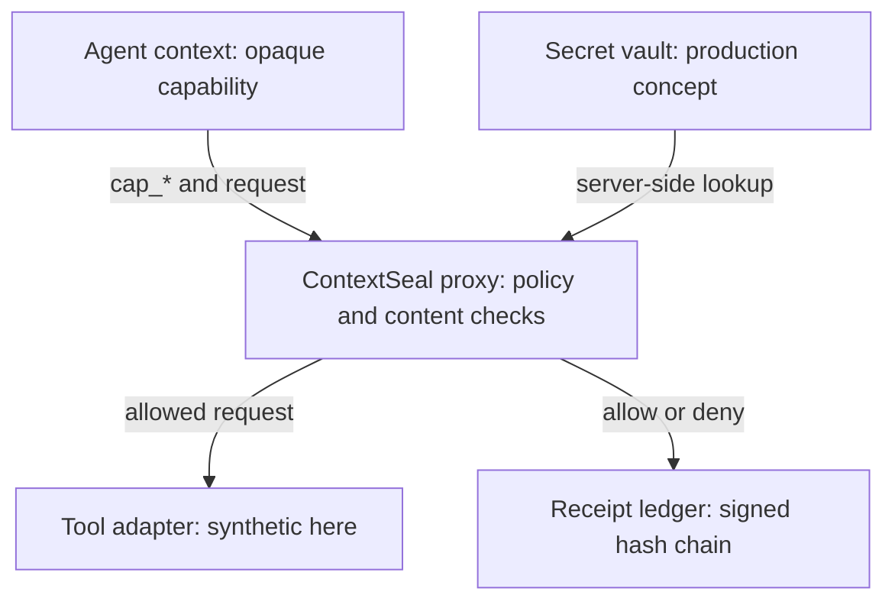

# ContextSeal — AI Action Receipts

Every AI-generated file should carry its own provenance—privately.

ContextSeal is a security reference implementation for AI agents that need to call tools without receiving raw provider credentials. It places a deny-by-default policy proxy between the agent and the tool, gives the agent an opaque capability reference, inspects each request, and records every allow or deny decision in a signed, hash-chained receipt.
It is also a trust-metadata layer for AI-generated work: the current demo shows decision-level receipts, while the product direction extends them to artifact hashes and private embedded or sidecar provenance.

The project is deliberately small and dependency-free. It demonstrates the security boundary clearly; it is not a production credential broker or complete MCP server.

## The problem

An agent may need authority to read a forecast, update a ticket, or call another API. Putting a reusable API key in model context creates unnecessary risk: untrusted content can influence the model, logs may retain context, and a broad credential can outlive the task that needed it.

- **Opaque capabilities:** `cap_*` references are safe to put in model context; the provider key never is.
- **Structural policy:** action and resource allowlists, expiry, and deny-by-default enforcement happen in the proxy.
- **Content firewall:** prompt-injection and credential-shaped payloads are quarantined before forwarding.
- **Evidence:** every allow/deny decision produces a tamper-evident action receipt with a previous-receipt link.
- **Private provenance:** receipts expose process and evidence—not secrets, private identities, or unnecessary personal data.
- **MCP audit:** `POST /mcp/audit` supports a read-only `contextseal.audit` method.

The sample data is synthetic. The demo does not call an external tool or connect to a secret vault. After running the safe path, use **[ bind artifact ]** to download `weather-brief.md` plus a `.receipt.json` sidecar containing the artifact hash, receipt hash, and signed manifest. This is the product's first portable artifact-provenance slice; it is not yet format-safe embedding inside arbitrary PDFs, DOCX files, or images.

ContextSeal changes what the agent receives. Instead of a provider key, the agent sees a reference such as:

```text
cap_weather_read_7f3d
```

The proxy resolves that reference on the trusted side of the boundary. It checks whether the capability exists, has not expired, permits the requested action and resource, and contains no obvious prompt-injection or credential-shaped input. Only a request that passes every check is eligible to reach a tool adapter.

## What the demo proves

- **Secrets stay outside model context.** The browser and agent receive opaque `cap_*` references, not provider credentials.
- **Authority is structural.** Each capability is limited by an exact tool action, resource, scope, and expiration time.
- **The default is deny.** An unknown, expired, mismatched, or unsafe request stops at the proxy.
- **Content is checked before forwarding.** Small prompt-injection and DLP detectors illustrate quarantine at the boundary.
- **Every decision leaves evidence.** Allow and deny results both mint an HMAC-signed receipt linked to the previous receipt hash.
- **Audit access is read-only.** A synthetic JSON-RPC endpoint exposes policy state and the receipt ledger without allowing tool execution.

All capabilities, tools, inputs, and credentials in this project are synthetic. The demo never contacts an external provider and never retrieves a real secret.

## Architecture



The agent, proxy, tool adapter, secret vault, and receipt store are separate trust zones. This repository implements the proxy behavior and an in-memory receipt ledger. The vault and external tool call are represented in the UI but intentionally simulated.

## Request lifecycle

For `POST /api/authorize`, ContextSeal:

1. Looks up the opaque capability ID.
2. Rejects an unknown capability.
3. Checks the expiration time.
4. Requires an exact match for the tool action.
5. Requires an exact match for the resource.
6. Inspects input for the demo's prompt-injection patterns.
7. Inspects input for the demo's credential-shaped patterns.
8. Allows only a request that passes every check.
9. Mints a receipt for the result, including denials.
10. Marks an allow as `would-forward-to-tool`; no real forwarding occurs.

The order matters. Safe-looking content cannot bypass an expired or over-broad capability, and unsafe content never reaches the simulated tool path.

## Capability model

| Field | Purpose |
|---|---|
| `id` | Opaque reference supplied by the caller |
| `principal` | Synthetic workload identity associated with the grant |
| `tool` | Exact action that may be requested |
| `resource` | Exact resource the action may target |
| `scopes` | Human-readable delegated authority |
| `expiresAt` | Hard time boundary checked by the proxy |
| `status` | Display state for the demo UI |
| `reason` | Human-readable grant rationale |

The active weather capability permits `weather.get_forecast` only for `weather://nyc`. It cannot be reused to call `tickets.update`, access another resource, or read the conceptual vault.

## Policy and content controls

`src/policy.mjs` implements three layers:

- **Capability policy:** existence, expiration, exact action, and exact resource checks.
- **Prompt-injection screen:** a compact set of patterns for common instruction-override language.
- **DLP screen:** patterns for API keys, bearer tokens, private-key headers, and explicit password or token fields.

The detectors are intentionally narrow teaching examples. They demonstrate where content controls belong, not the recall or precision expected from a production security product.

## Receipts

Every decision produces a receipt with a monotonic in-process ID, timestamp, synthetic principal, requested action and resource, decision, reason code, capability reference, previous receipt hash, current receipt hash, and HMAC-SHA-256 signature.

The first receipt points to `GENESIS`. Later receipts include the prior receipt hash, forming a chain. Changing a past receipt breaks the downstream link. The signature provides integrity evidence for anyone who possesses the signing key.

The ledger is memory-only and resets when the server restarts. The authorization response abbreviates the signature for display; the read-only audit response retains the full signature.

## Interactive demo

The browser UI includes an explorable policy map and three walkthroughs:

1. **Run safe forecast** shows a valid request crossing the policy boundary and receiving an allow receipt.
2. **Quarantine injection** sends instruction-override text and stops at the proxy with a prompt-injection receipt.
3. **Block secret-shaped input** sends a synthetic credential-shaped value and stops with a DLP receipt.

Nodes can be dragged, selected for plain-language explanations, reset, focused with the keyboard, and nudged with arrow keys. Denied walkthroughs visibly stop at the proxy instead of animating through a tool.

## Run locally

Requirements:

- Node.js 20 or newer
- no package installation

```bash
npm test
npm run lint
npm start
```

Open `http://localhost:4178`.

The scripts wrap Node's built-in test runner and syntax checker. The project has no runtime or development dependencies.

Production mode (`NODE_ENV=production`) fails closed unless `RECEIPT_SIGNING_KEY` and `CONTEXTSEAL_AUTH_TOKEN` are set to values at least 32 characters long. Authenticated requests use `Authorization: Bearer <CONTEXTSEAL_AUTH_TOKEN>`. `CONTEXTSEAL_DEMO_MODE=1` is an explicit exception for this public synthetic demo only; it must never be used for real workloads or real receipts. Local development remains an explicitly unauthenticated synthetic demo unless `CONTEXTSEAL_REQUIRE_AUTH=1` is set.

Outside demo mode, `RECEIPT_LEDGER_PATH` is also required. The service fsyncs an append-only JSONL receipt ledger and refuses to start if the ledger is missing or malformed. Mount that path on durable, access-controlled storage; an ephemeral container filesystem is not an audit store.

The hosted synthetic demo is [context-seal-production.up.railway.app](https://context-seal-production.up.railway.app/). It contains no external tool connection, real capability store, identity provider, or user data. A real deployment must disable demo mode, add identity-bound authorization, configure durable ledger storage, and complete an independent security review before exposing receipt APIs.

## Verify

```bash
# 16 unit tests
npm test

# Server, policy, and browser JavaScript syntax
npm run lint
```

The suite covers allowed and denied policy paths, capability expiration, action scope, prompt-injection and DLP blocking, inspection output, deterministic HMAC signing, artifact binding and tamper detection, graph explanations and bounds, and allowed versus denied walkthrough paths.

After starting the server:

```bash
curl http://localhost:4178/health

curl -X POST http://localhost:4178/api/authorize \
  -H 'content-type: application/json' \
  --data '{
    "capabilityId":"cap_weather_read_7f3d",
    "action":"weather.get_forecast",
    "resource":"weather://nyc",
    "input":"Synthetic request: forecast for NYC"
  }'

curl -X POST http://localhost:4178/mcp/audit \
  -H 'content-type: application/json' \
  --data '{"jsonrpc":"2.0","method":"contextseal.audit","id":1}'
```

## API reference

| Method | Path | Purpose |
|---|---|---|
| `GET` | `/health` | Liveness, start time, and current receipt count |
| `GET` | `/api/bootstrap` | Redacted capabilities, graph data, and receipts for the UI |
| `POST` | `/api/authorize` | Evaluate `{ capabilityId, action, resource, input }` and mint a receipt |
| `GET` | `/api/receipts` | Return the current in-memory ledger |
| `POST` | `/mcp/audit` | Serve the read-only `contextseal.audit` JSON-RPC method |
| `POST` | `/api/artifacts/export` | Bind an allowed receipt to a synthetic artifact and return a signed sidecar |
| `POST` | `/api/artifacts/verify` | Verify artifact bytes, manifest hash, and server signature |

An allow returns HTTP `200`. A policy denial returns `403` and still includes a receipt. Invalid JSON or an unsupported audit method returns `400`; payloads over 100 KB return `413`.

Denial codes:

- `unknown-capability`
- `expired-capability`
- `action-not-allowlisted`
- `resource-out-of-scope`
- `prompt-injection`
- `dlp-block`

## Repository map

```text
.
├── public/
│   ├── app.js          # UI, walkthroughs, drag and keyboard behavior
│   ├── graph.mjs       # Layout, explanations, bounds, and path logic
│   ├── index.html      # Interactive demo structure
│   └── styles.css      # Visual system and responsive layout
├── src/policy.mjs      # Capability checks, inspection, hashes, signatures
├── src/artifacts.mjs   # Artifact hashing, manifests, and verification
├── test/               # Policy, signing, artifact, graph, and walkthrough tests
├── server.mjs          # HTTP server, API, ledger, and static files
├── THREAT_MODEL.md     # Trust boundaries and production hardening
├── HANDOFF.md          # Demo and deployment handoff
└── package.json        # Node version and scripts
```

## Configuration and deployment

The server listens on `PORT`, defaulting to `4178`.

For any shared environment, set a strong random `RECEIPT_SIGNING_KEY` as a sealed variable. The checked-in development fallback is public and cannot provide trustworthy evidence.

Example Railway deployment:

```bash
railway up --new --name context-seal
```

Configure `RECEIPT_SIGNING_KEY` in Railway and never commit it. The synthetic demo needs no database, but a production ledger does.

## Security boundaries and limitations

ContextSeal does **not** currently provide:

- authentication or caller identity verification;
- identity- or audience-bound capabilities;
- a real vault or provider credential lookup;
- actual MCP tool forwarding;
- durable append-only receipt storage;
- replay protection, nonces, rate limiting, or tenant isolation;
- signing-key rotation, key IDs, KMS, or HSM support;
- policy versioning or approval provenance;
- comprehensive DLP or prompt-injection detection; or
- an independent receipt-chain and signature verifier.

See [THREAT_MODEL.md](THREAT_MODEL.md) for the full production hardening checklist.

## Production direction

1. Authenticate the workload and bind each capability to identity, audience, tenant, and purpose.
2. Keep provider credentials in a secret manager inaccessible to the model process.
3. Use short-lived grants with nonces and replay protection.
4. Validate typed request schemas before content inspection.
5. Route approved requests through isolated tool adapters.
6. Write receipts to an append-only durable ledger.
7. Sign with rotated KMS or HSM keys and include key IDs.
8. Expose independent chain and signature verification.
9. Add rate limits, tenant isolation, observability scrubbing, and alerts.
10. Test policy and detectors against a broad adversarial corpus.

## Status

The current implementation has 16 passing tests, clean JavaScript syntax checks, and locally smoke-tested health, bootstrap, authorization, artifact export/verification, and read-only audit endpoints.

## License

No license file is currently included. Add one before inviting external reuse or contributions.
This is a focused reference implementation: its ledger is in-memory, capability storage is fixture-backed, signatures use an HMAC secret, and the DLP/injection detectors are intentionally small. Production artifact provenance additionally needs canonical artifact hashing, format-safe embedding or private sidecars, durable storage, key rotation/HSM, identity binding, replay protection, policy versioning, a real secret manager, and a full content-security test corpus.
